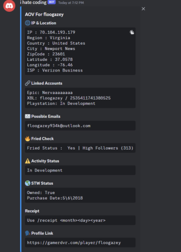

# Fortnite pulling bot mega skid version

This is a bot similar to MoonFN or Scout Bot that is used to gain info on a Fortnite user account to pull their account, if anyone has fr coded a bot like this they know this is a mega skid version

# How this piece of trash code works

- For a user's IP, it uses a webdriver to go to xresolver.com to manually look it up their so the user doesnt need their own DB and can skid off xresolver.
- For linked accounts, it takes the XBL username and searches it on Fortnite tracker then takes the link it gets sent to and filters it for the Epic username
- For XUID, STW, and STW Purchase Date it uses OpenXBL API.
- For fried check it goes to gamerdvr and checks the user's view count.
- For IP info it uses some random API I found about ip's.
- For emails typically you need a huge DB of gamertag:email from a vulnerability from 2021 where you could find a users email from their xuid, I WILL NOT BE POSTING THIS FIND YOU OWN DB. to make it simple i just made it sort through a txt file 
- For receipt it just generates an HTML file with the purchase date opens it on a webdriver and takes a screenshot

# example

# please for the love of god dont sell this
